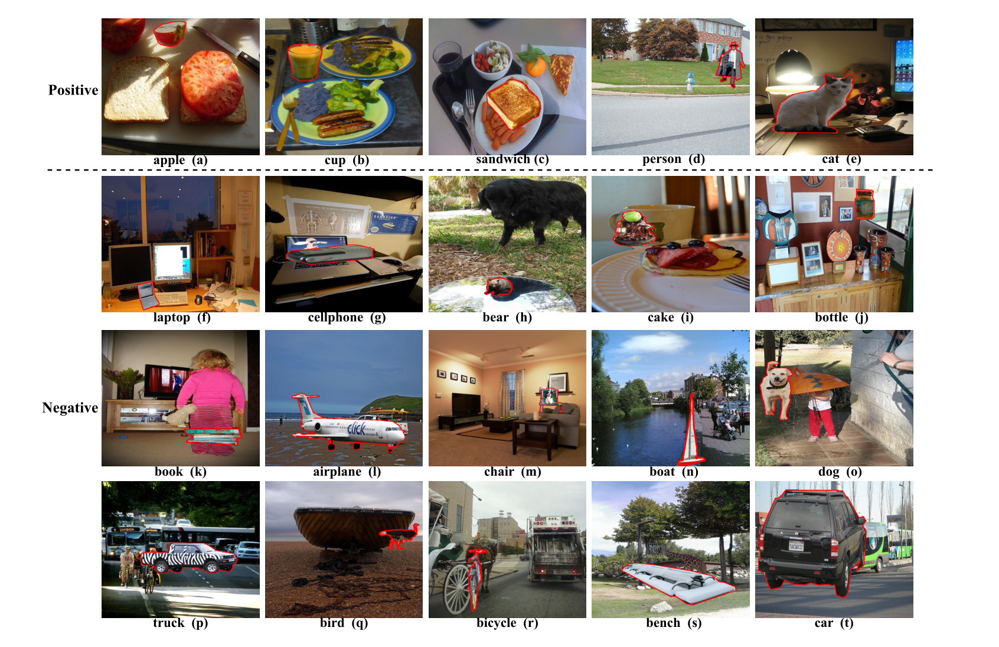

# Object-Placement-Assessment-Dataset-OPA

**Object-Placement-Assessment** (OPA) is to verify whether a composite image is plausible in terms of the object placement. The foreground object should be placed at a reasonable location on the background considering location, size, occlusion, semantics, and etc.


## Dataset

Our dataset **OPA** is a synthesized dataset for Object Placement Assessment based on [COCO](http://cocodataset.org) dataset.  We select unoccluded objects from multiple categories as our candidate foreground objects. The foreground objects are pasted on their compatible background images with random sizes and locations to form composite images, which are sent to human annotators for rationality labeling. Finally, we split the collected dataset into training set and test set, in which the background images and foreground objects have no overlap between training set and test set. We show some example positive and negative images in our dataset in the figure below.



Illustration of OPA dataset samples: Some positive and negative samples in our OPA dataset and the inserted foreground objects are marked with red outlines. Top row: positive samples; Bottom rows: negative samples, including objects with inappropriate size (e.g., f, g, h), without supporting force (e.g., i, j, k), appearing in the semantically unreasonable place (e.g., l, m, n), with unreasonable occlusion (e.g., o, p, q), and with inconsistent perspectives (e.g., r, s, t).

Our OPA dataset contains 62,074 training images and 11,396 test images, in which the foregrounds/backgrounds in training set and test set have no overlap. The training (resp., test) set contains 21,376 (resp.,3,588) positive samples and 40,698 (resp., 7,808) negative samples. Besides, the training (resp., test) set contains 2,701 (resp., 1,436) unrepeated foreground objects and1,236 (resp., 153) unrepeated background images. The OPA dataset is provided in [**Baidu Cloud**](https://pan.baidu.com/s/1IzVLcXWLFgFR4GAbxZUPkw) (access code: a982) or [**Google Drive**](https://drive.google.com/file/d/133Wic_nSqfrIajDnnxwvGzjVti-7Y6PF/view?usp=sharing).

## Dataset Extension

Based on the foregrounds and backgrounds from OPA dataset, we additionally synthesize 80263 composite images and annotate their binary rationality labels. We refer to the extended set as OPA-ext, which includes 28455 positive composite images and 51808 negative composite images. Note that the labels in OPA-ext are relatively more noisy than OPA dataset. With the same data format as OPA, the OPA-ext dataset is provided in [**Baidu Cloud**](https://pan.baidu.com/s/1GTGwISKJIIp1HZ5AYJSH4w?pwd=fogy) (access code: fogy). 

## Prerequisites

- Python

- Pytorch

- PIL


## Getting Started

### Installation

- Clone this repo:

  ```bash
  git clone https://github.com/bcmi/Object-Placement-Assessment-Dataset-OPA.git
  cd Object-Placement-Assessment-Dataset-OPA
  ```

- Download the OPA dataset. We show the file structure below:

  ```
  ├── background:
       ├── category:
                ├── imgID.jpg
                ├── ……
       ├── ……
  ├── foreground:
       ├── category:
                ├── imgID.jpg
                ├── mask_imgID.jpg
                ├── ……
       ├── ……
  ├── composite:
       ├── train_set:
                ├── fgimgID_bgimgID_x_y_w_h_scale_label.jpg
                ├── mask_fgimgID_bgimgID_x_y_w_h_scale_label.jpg
                ├── ……
       └── test_set:
  ├── train_set.csv
  └── test_set.csv
  ```

  All backgrounds and foregrounds have their own IDs for identification. Each category of foregrounds and their compatible backgrounds are placed in one folder. The corresponding masks are placed in the same folder with a mask prefix.

  Four values are used to identify the location of a foreground in the background, including `x y` indicating the upper left corner of the foreground and `w h` indicating width and height. Scale is the maximum of `fg_w/bg_w` and `fg_h/bg_h`. The label (0 or 1) means whether the composite is reasonable in terms of the object placement.

  The training set and the test set each has a CSV file to record their information.

- We also provide a script in `/data_processing/` to generate composite images:

  ```
  python generate_composite.py
  ```

  After running the script, input the foreground ID, background ID, position, label, and storage path to generate your composite image.

## Our SimOPA 
- Download pretrained model from [Baidu Cloud](https://pan.baidu.com/s/1xozUrbiBjGrchdcF1007sA)(access code: up1c) and put it in "best-acc.pth"
- Download pretrained resnet18 from https://download.pytorch.org/models/resnet18-5c106cde.pth or [Baidu Cloud](https://pan.baidu.com/s/1RCrfRiKCpY_SY7Ddeo_B1A)(access code: msqg) and put it in "pretrained_models/resnet18.pth"
- To train a model, run:
```
python train.py
```
- To test the pretrained model, run:
```
python test_model.py
```
## Bibtex

If you find this work useful for your research, please cite our paper using the following BibTeX  [[arxiv](https://arxiv.org/pdf/2107.01889.pdf)]:

```
@article{liu2021OPA,
  title={OPA: Object Placement Assessment Dataset},
  author={Liu,Liu and Liu,Zhenchen and Zhang,Bo and Li,Jiangtong and Niu,Li and Liu,Qingyang and Zhang,Liqing},
  journal={arXiv preprint arXiv:2107.01889},
  year={2021}
}
```
